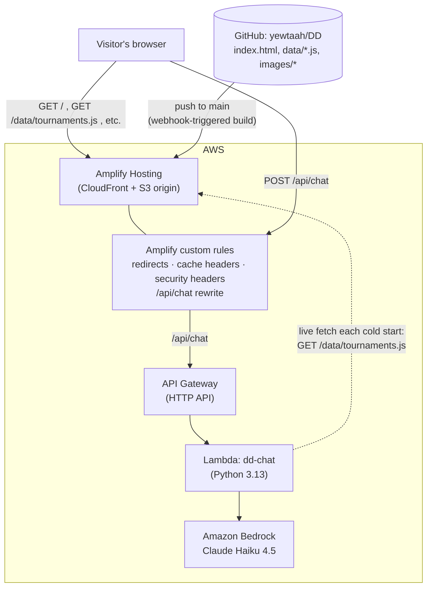
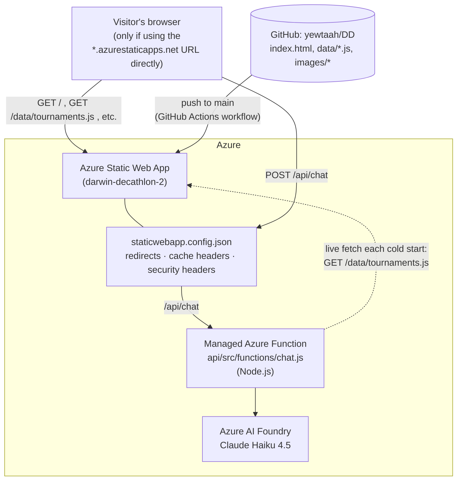
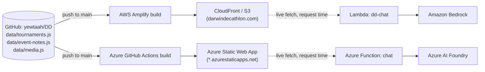

# Deployment & Infrastructure

This site runs on **two independent cloud deployments at once** — AWS and Azure.
Both serve the same code from this repo and ground every chatbot answer in the
same file (`data/tournaments.js`); nothing about the *content* differs between
them. What differs is which cloud's compute is currently wired to
`darwindecathlon.com`, and which one is sitting idle as a warm fallback.

Screenshots of the live consoles aren't included here (redacting account IDs
and ARNs out of a batch of console screenshots wasn't done for this pass) —
the diagrams below are generated directly from the actual resource
configuration, not mocked up.

## Why two clouds

The site launched on Azure Static Web Apps. In August 2026 the custom domain
(`www.darwindecathlon.com`) started failing TLS entirely — Azure's
managed certificate for the custom domain had drifted out of sync with what
was actually being served (`SEC_E_WRONG_PRINCIPAL` / certificate name
mismatch), while the app's own `*.azurestaticapps.net` hostname kept working
fine throughout. Rather than debug Azure's managed-cert pipeline, the decision
was to stand up the same site on AWS and cut the domain over there. The Azure
deployment was **not** decommissioned — it's left running as a fully working
fallback, just no longer attached to the custom domain.

## Which cloud is live right now

| | AWS | Azure |
|---|---|---|
| Serves `darwindecathlon.com` / `www.darwindecathlon.com`? | **Yes** (active) | No (DNS no longer points here) |
| Still deployed and running? | Yes | Yes |
| Reachable directly? | via the custom domain | via its own `*.azurestaticapps.net` hostname only |
| Auto-deploys on push to `main`? | Yes | Yes |

Both stay live and both redeploy automatically on every push to `main` — they
just don't share traffic. Cutting back to Azure means fixing its managed-cert
issue and repointing DNS; cutting AWS off means deleting the AWS resources
described below. Neither has been done.

## Architecture comparison

| Layer | AWS | Azure |
|---|---|---|
| Static hosting | AWS Amplify Hosting (CloudFront + S3 origin, no build step) | Azure Static Web Apps |
| Deploy trigger | Amplify app connected directly to the GitHub repo (webhook) | `.github/workflows/azure-static-web-apps-*.yml` GitHub Actions workflow |
| Chat backend compute | AWS Lambda (Python 3.13) | Azure Functions (Node.js, managed/bundled into the Static Web App) |
| Chat backend → model | Amazon Bedrock, Claude Haiku 4.5 via a cross-region inference profile, IAM-authenticated | Azure AI Foundry, Claude Haiku 4.5 via the Anthropic Foundry SDK, API-key-authenticated |
| Chat API surface | API Gateway (HTTP API) → Lambda, proxied through an Amplify rewrite rule so the browser still calls same-origin `/api/chat` | Native `/api/*` routing built into Azure Static Web Apps (`api_location: "api"` in the workflow) |
| Routing / redirects / headers | Amplify "custom rules" + "custom headers", ported 1:1 from `staticwebapp.config.json` | `staticwebapp.config.json`, read natively by Azure Static Web Apps |
| Custom domain + cert | Route53 + an Amplify-managed ACM certificate | Azure DNS zone + an Azure-managed certificate (the one that broke) |
| DNS zone (authoritative) | Route53 hosted zone | Azure DNS zone still exists, but the domain's nameservers no longer point at it |
| Email (MX / DKIM / SES) | Amazon WorkMail + SES, via records in the same Route53 zone | N/A — mail was already running on AWS WorkMail/SES before this migration; the records were carried over into Route53 unchanged when the zone moved |

Nothing about `data/tournaments.js`, `data/event-notes.js`, or `data/media.js`
is duplicated per-cloud. Both chat backends fetch the *live* file from their
own cloud's static hosting at request time rather than bundling a copy — see
[`CLAUDE.md`](CLAUDE.md) for why that file is the one approved grounding
source in the first place.

---

## AWS architecture (active)

### Static page request

1. Browser requests `darwindecathlon.com` (or `www.`) → Route53 resolves to
   the CloudFront distribution behind AWS Amplify Hosting.
2. Amplify serves the file straight from its S3-backed origin if one exists
   at that path. `images/*` gets a one-week immutable cache header,
   `data/*.js` gets a 5-minute cache header, everything gets the same
   security headers `staticwebapp.config.json` set on Azure
   (`X-Content-Type-Options`, `Referrer-Policy`, `X-Frame-Options`,
   `Permissions-Policy`).
3. For a path with no matching file — one of the 13 retired v1 pages
   (`Skeet.html`, `Champs.html`, …) — an Amplify custom rule 301-redirects to
   the equivalent Field Notes or Chronicles deep link, exactly like the old
   `staticwebapp.config.json` routes did. Any other unknown path falls back to
   serving `index.html`'s content with a `404` status (a direct port of
   Azure's `responseOverrides.404` rewrite).

### Chat request (Natasha's text Q&A)

1. `index.html`'s chat form does a same-origin `POST /api/chat`
   (`index.html:957`) — no client code changed during the migration.
2. An Amplify custom rule transparently rewrites that request to the API
   Gateway HTTP API endpoint (a `200`-status rewrite, invisible to the
   browser — it never sees a redirect or a different origin).
3. API Gateway's default route uses a Lambda proxy integration to invoke
   `dd-chat`.
4. The Lambda validates the request (non-empty last message, length caps,
   history trimmed to the last 20 messages — same limits as the original
   Azure Function).
5. On a cold start, the Lambda fetches `data/tournaments.js` live from
   Amplify's own stable default domain (not the custom domain — same
   reasoning the Azure Function used: the custom domain can change or break
   independently of the backend, so the fetch target is pinned to hosting
   infra that doesn't move) and caches it in memory for the life of that
   execution environment.
6. The Lambda calls Bedrock's `Converse` API: the same system prompt as the
   Azure version (grounding rules, PII boundaries, "no live tournament"
   guardrail, plain-text-only replies) plus the fetched data as an ephemeral
   system block, model = Claude Haiku 4.5 via the
   `us.anthropic.claude-haiku-4-5` cross-region inference profile.
7. Bedrock's reply text comes back through Lambda → API Gateway → the
   Amplify rewrite → the browser, as the same `{"reply": "..."}` shape the
   frontend already expected.

Two non-obvious pieces of IAM this required, worth knowing if this ever needs
rebuilding: the Lambda's execution role needs `bedrock:InvokeModel` on the
foundation-model ARN with a **wildcard region** (`arn:aws:bedrock:*::...`),
because a cross-region inference profile can dispatch the actual call to any
region in its set, not just the one the Lambda runs in — and it separately
needs `aws-marketplace:ViewSubscriptions` / `aws-marketplace:Subscribe`,
because Bedrock silently lazy-subscribes the calling principal to third-party
models like Anthropic's on first use.

### Domain and email

`darwindecathlon.com` is registered through Route53 Domains in the same AWS
account, so the whole cutover — hosted zone, nameservers, and the domain
registration itself — lives in one place. The zone carries the site's `A`
(apex, aliased straight to the CloudFront distribution) and `www` (`CNAME`)
records alongside the **pre-existing** WorkMail/SES email records (`MX`, 3
DKIM `CNAME`s, an SES verification `TXT`, and an `autodiscover` `CNAME`) —
those were carried over unchanged from the old Azure DNS zone and have
nothing to do with the site migration; they just happen to live in the same
zone.

---

## Live scorekeeping (AWS-only, new in 2.1.0)

A second, independent AWS subsystem sits alongside the chat backend: a real
relational database, written to directly from scorekeepers' phones during a
live event rather than through the flat `data/*.js` files everything else on
the site reads from.

- **Aurora Serverless v2 (PostgreSQL)**, cluster `dd-live-scoring`, accessed
  via the **RDS Data API** — same reasoning as the chat Lambda's Bedrock
  calls: no VPC networking needed by either the schema migration or the
  application Lambda, just IAM-authenticated HTTPS. Full schema:
  [`data/schema.sql`](data/schema.sql).
- **Lambda + API Gateway** at `/api/scorekeeper` (`aws/lambda/scorekeeper`),
  proxied through the same Amplify-rewrite pattern as `/api/chat`. Routes:
  `GET /event`, `GET /scores`, `POST /login`, `POST /scores/golden-tee`,
  `POST /scores/corn-hole`.
- **Auth** is one shared password per `tournament_event` (table
  `scorekeeper_credentials`), re-checked on every write rather than via a
  signed session token, plus a free-text scorekeeper name captured on each
  row for attribution. Proportionate to a private friend-group tournament,
  not a system that needs real session management.
- **Audit trail**: every write goes through one `_upsert_result()` helper in
  the Lambda that logs a before/after snapshot to `results_audit` — the
  "CRUD-safe" requirement this was built against.
- **Training vs. real tournaments**: piloted events (Golden Tee, Corn Hole so
  far) attach to a `tournaments` row with `tournament_type = 'training'`,
  which the standings/win-count views filter out by design — a scorekeeping
  trial never inflates anyone's career record.
- **Two IAM gotchas hit while building this**, worth knowing if it needs
  rebuilding: `boto3.client("rds-data")` silently uses the caller's *local*
  default AWS region rather than erroring if it doesn't match the cluster's
  actual region (bit the test suite before it bit anything real); and
  `results.partner_player_id` has no `ON DELETE` behavior, so deleting a
  player who's still referenced as someone else's teammate fails on the FK —
  see the comment on that column in `data/schema.sql` for the fix if a
  player-delete feature ever lands.

Adding the next event's scoring is meant to be cheap: one `tournament_event`
row + a `scorekeeper_credentials` row in the database, one submit handler in
the Lambda, one entry form + one line in `SK_EVENTS`/`LIVE_SCORING_SLUGS` in
`index.html`. The login/session/audit/viewer plumbing is already shared.

---

## Azure architecture (fallback, still running)

### Static page request

Same shape as AWS: `staticwebapp.config.json` drives the redirects, cache
headers, and security headers directly (Azure Static Web Apps reads this file
natively, no translation needed — it's the file the Amplify custom
rules/headers above were ported *from*). The one live difference right now is
reachability: with DNS pointed at Route53, the custom domain no longer routes
here at all. The only way to reach this deployment today is its own
`ashy-hill-05c5adc10.7.azurestaticapps.net` hostname.

### Chat request

1. `POST /api/chat` is handled natively by Azure Static Web Apps' integrated
   Functions runtime (`api_location: "api"` in the GitHub Actions workflow) —
   no separate gateway or rewrite needed, since Azure Static Web Apps and its
   Functions share one deployment unit by design.
2. Same request validation as the AWS version (this logic was ported to
   Python for Lambda, not the other way around — Azure's Node.js function is
   the original).
3. On a cold start, the function fetches `data/tournaments.js` live from its
   *own* `azurestaticapps.net` hostname (hardcoded for the same
   custom-domain-independence reason as the AWS version).
4. Calls Azure AI Foundry via the `@anthropic-ai/foundry-sdk` client
   (`ANTHROPIC_FOUNDRY_API_KEY` / `ANTHROPIC_FOUNDRY_RESOURCE` env vars),
   same system prompt, same model (Claude Haiku 4.5).
5. Returns `{"reply": "..."}` the same way.

### Domain and email

The Azure DNS zone for `darwindecathlon.com` still exists with its original
records, but the domain's nameservers were repointed to Route53 during the
AWS migration, so this zone is no longer authoritative for anything — it's
inert unless nameservers are switched back.

---

## Source of truth, either way

Both chatbot backends are, deliberately, thin wrappers: neither bundles a
copy of the tournament data at deploy time, both fetch it fresh from their
own live static hosting on every cold start. There is exactly one source of
truth for scores, standings, and champions — the git-tracked files in
`data/` — and it's impossible for the two clouds' chatbots to answer
differently unless one of them is running stale deployed code.

## Rebuilding or tearing either one down

- **AWS**: Amplify app (`darwin-decathlon`) → Lambda (`dd-chat`) → its IAM
  role → the API Gateway HTTP API → the Route53 hosted zone, roughly in
  reverse-dependency order if tearing down. Watch for the two Bedrock IAM
  gotchas above if rebuilding the Lambda from scratch.
- **Azure**: standard Static Web Apps teardown — delete the Static Web App
  resource (which takes its managed Function with it) and the DNS zone if no
  longer needed. Nothing in the AWS deployment depends on Azure staying up,
  so this is safe to do at any time without affecting `darwindecathlon.com`.
